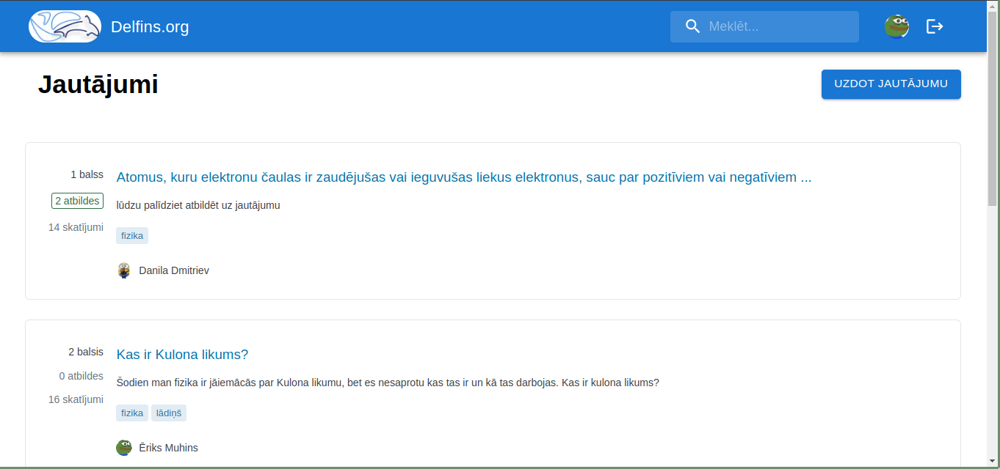

# Delfins.org



[delfins.org](https://delfins.org)

To run the project locally do the follwing
```bash
npm install
npm run dev
```
Now it should be available at [localhost:3000](http://localhost:3000)
